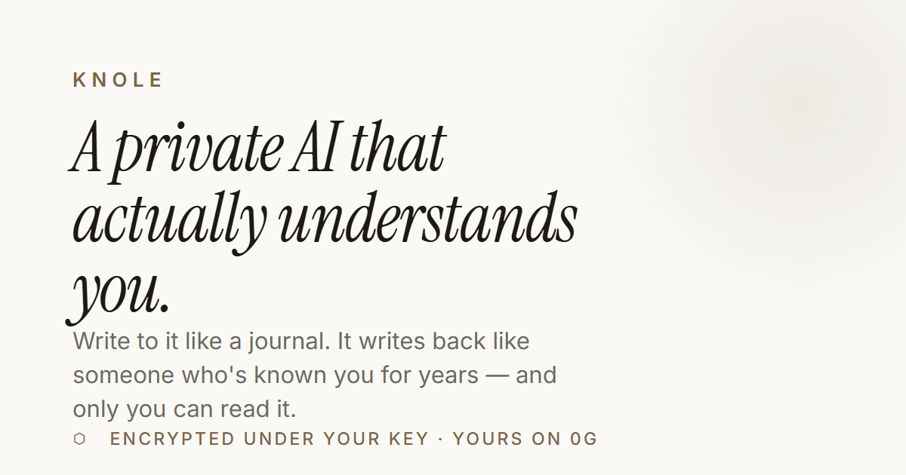
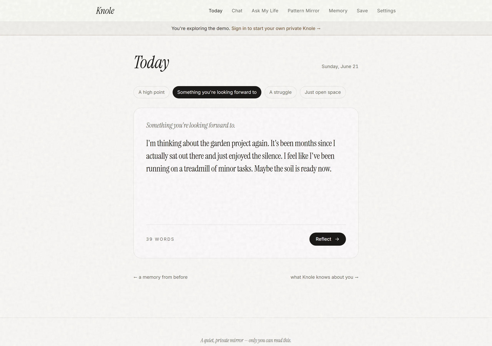
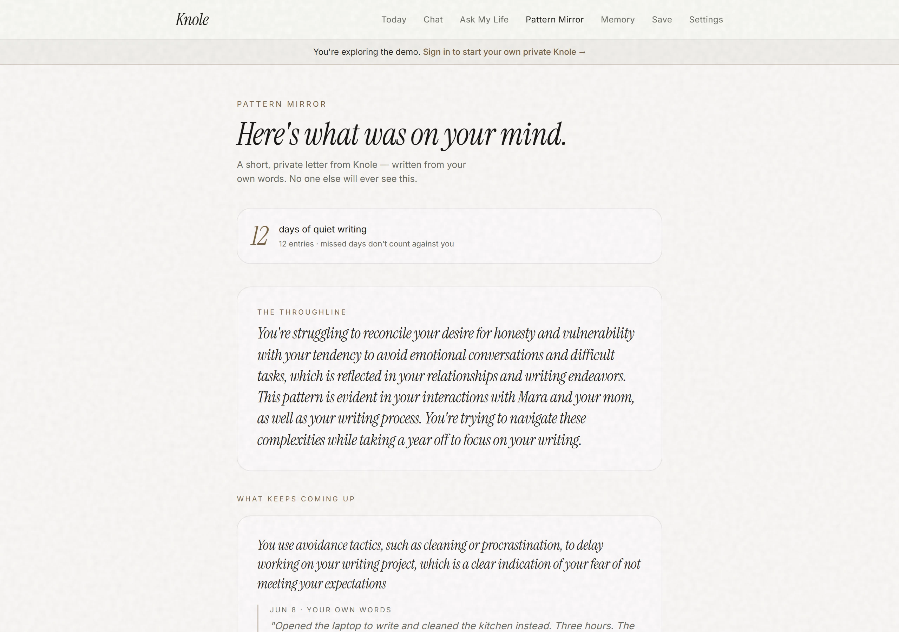
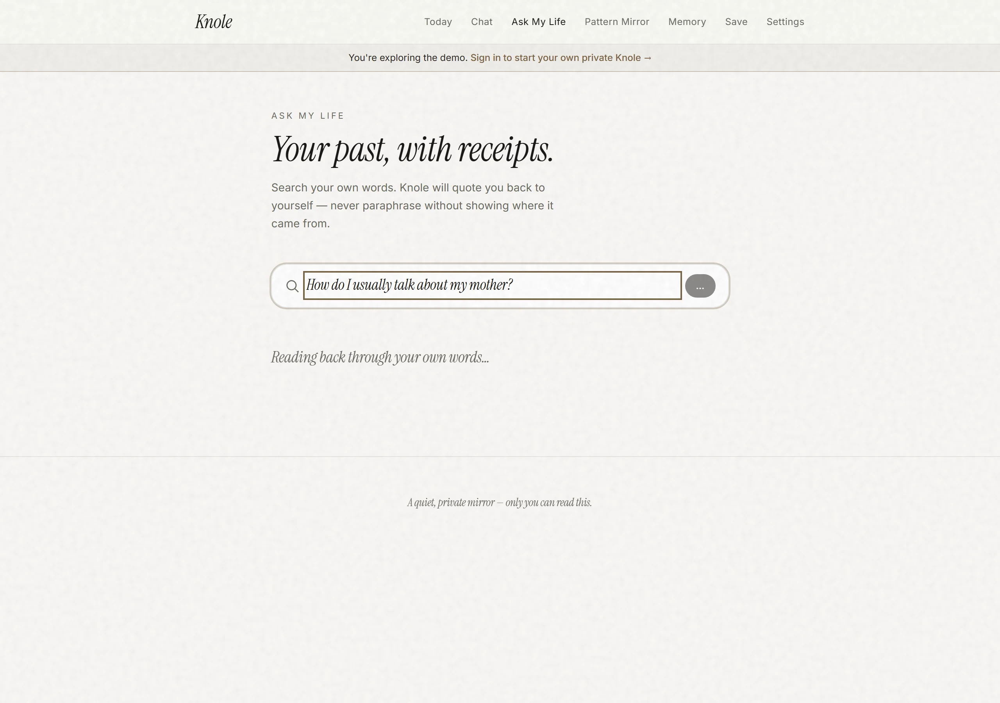
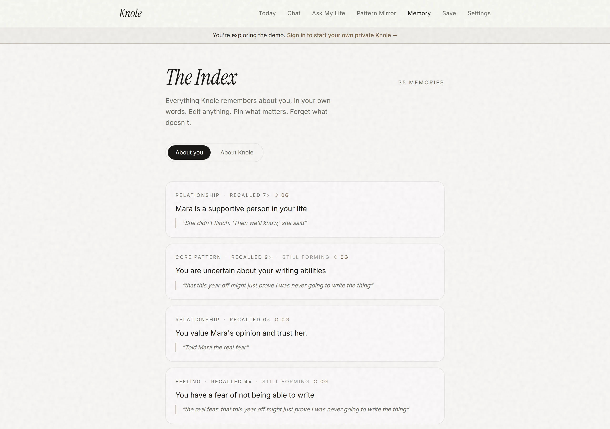
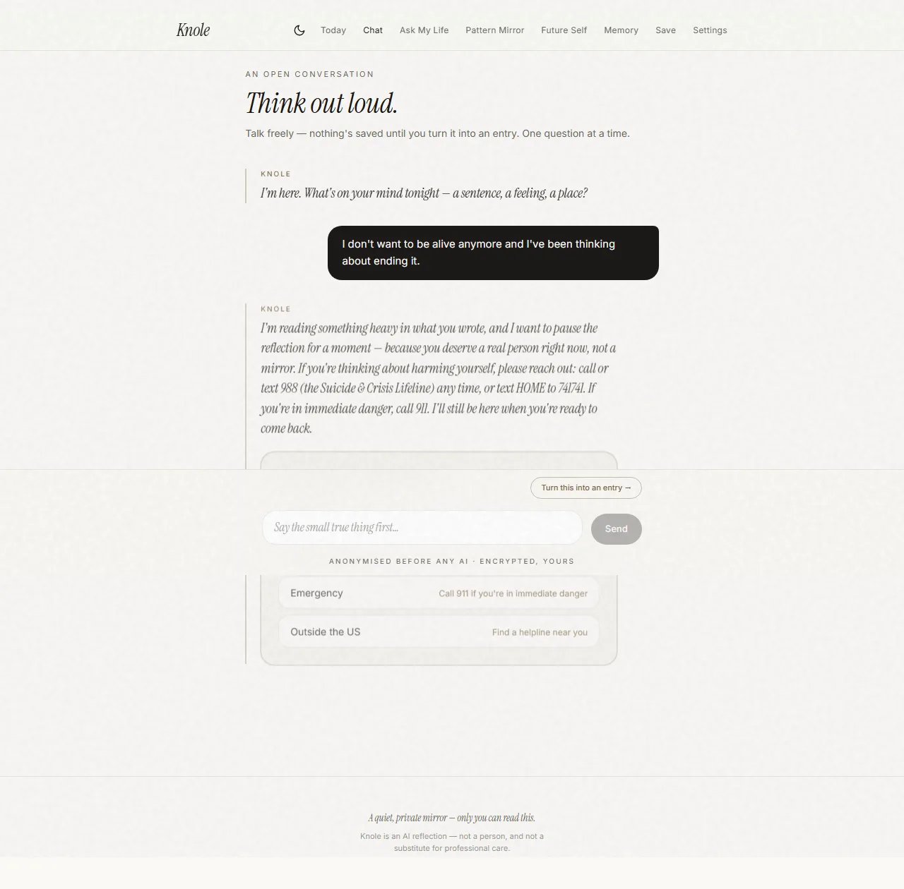
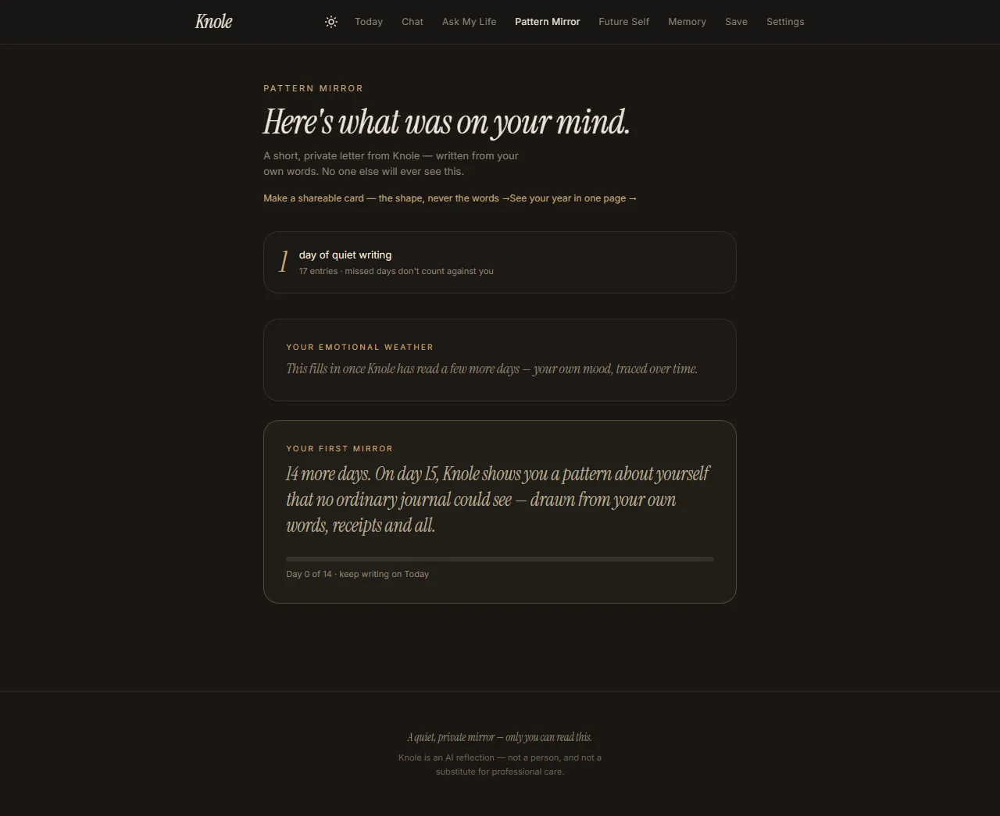
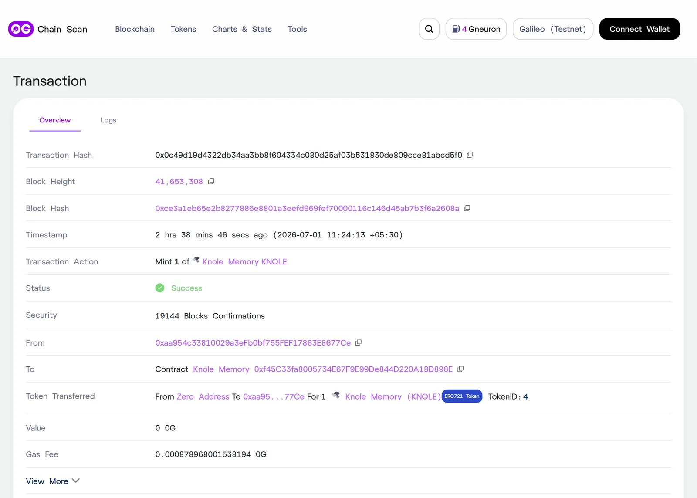

<div align="center">



<h3>A private AI journal that acts as a mirror, not an assistant</h3>

<p><em>Anonymized before inference · read inside a 0G TEE · encrypted under your key · recoverable from 0G · minted to your wallet</em></p>

[](https://knole-app.vercel.app) [](https://youtu.be/rqOQbSuONPg) [](https://knole-app.vercel.app/proof-deck.html) [](https://comfortable-goal-205.notion.site/Knole-3869c0ce78768120b4bbce690981b6db)

 -2ea043?style=flat-square)   [](https://github.com/Pratiikpy/Knole/actions/workflows/ci.yml) 

</div>

> **📖 Start here → [the full product overview on Notion](https://comfortable-goal-205.notion.site/Knole-3869c0ce78768120b4bbce690981b6db)** — the complete story: visuals, architecture, PMF research, the privacy model, and the build journey. **If you open one link, make it this one.** Everything below is a summary.

<div align="center">

| | | |
|:---:|:---:|:---:|
| <br/><sub>**Today** — a reflection from your past</sub> | <br/><sub>**The 14-Day Mirror** — patterns, dated</sub> | <br/><sub>**Ask My Life** — quoted with receipts</sub> |
| <br/><sub>**The Index** — editable, ⬡ 0G-stamped</sub> | <br/><sub>**Crisis-safe** — real help, not a bot</sub> | <br/><sub>**Night** — a full dark theme</sub> |

</div>

---

## The Problem

AI has quietly become where people process their decisions, relationships, and emotions. Yet every AI journal asks you to trust a company with your most private writing — and that trust is a **policy, not a mechanism.** A court recently forced OpenAI to produce 20M "deleted" ChatGPT logs.

The demand is already proven — people upload years of journals into LLMs hunting for patterns, and venture-backed apps have validated the market (**Rosebud** $6M/~10k payers · **Mindsera** 80k users · **PIN AI** $10M from a16z). The missing piece isn't demand. It's **privacy, trust, and true ownership.** That is Knole.

## What Knole Does

- **Daily Reflection** — reflects through four lenses (**Gentle Mirror · Pattern Finder · Blunt Friend · Decision Coach**), grounded in your own history and built to challenge, not flatter.
- **The 14-Day Mirror** — every two weeks, a private letter from your past self: recurring patterns, contradictions, and avoided decisions, each tied to a dated entry.
- **Ask My Life** — answers drawn only from your journal, quoting the original entries back with receipts.
- **The Index** — every memory with source quotes, edit/forget controls, append-only history, and a `⬡ 0G` badge.
- **And more** — Future-Self · AI Wrapped · Year Review · On-This-Day · Mood Timeline · Chrome Capture · ChatGPT/journal import · Omission Radar · Crisis Safety (SB243).

## Privacy by Architecture

Trust is minimized at every layer:

1. Local **MiniLM** embeddings — the vectors never leave the machine
2. Local **anonymization** before any prompt
3. Reflection inside a **0G TEE** (sealed inference)
4. **AES-256-GCM** encryption under user-controlled keys
5. Encrypted storage on **0G Storage**
6. Memory roots anchored on **0G Chain**
7. Deterministic **restore from 0G**
8. **ERC-7857 Memory iNFT** — owned by the user's wallet, un-sellable

> Even if the enclave were compromised, the model would still only ever see **anonymized text.**

## Why 0G

| Layer | How Knole uses it |
| --- | --- |
| **0G Compute** | Sealed AI inference inside a TEE |
| **0G Storage** | Encrypted journal entries |
| **0G Chain** | Integrity roots + memory ownership (iNFT) |

If the external model is ever unavailable, Knole **falls back to the 0G TEE** — an outage costs latency, never capability or privacy.

## Proof, Not Promises

Every major claim is verifiable — and here's the on-chain proof, live on the 0G explorer:

<div align="center">

<br/><sub><b>A real ERC-7857 mint on 0G Galileo</b> — <a href="https://chainscan-galileo.0g.ai/tx/0x0c49d19d4322db34aa3bb8f604334c080d25af03b531830de809cce81abcd5f0">verify the transaction ↗</a> · <a href="https://chainscan-galileo.0g.ai/address/0xf45C33fa8005734E67F9E99De844D220A18D898E">the contract ↗</a></sub>
</div>

- **21 automated evaluation suites** in CI — retrieval, groundedness, privacy-leak, crypto, isolation
- **Restore-from-chain** verification with real Galileo roots
- A **headless real-wallet end-to-end run** — inbox → Privy OTP → wallet-signed encryption → on-chain mint
- A public **[Proof Deck](https://knole-app.vercel.app/proof-deck.html)** documenting every feature with screenshots and commands

Built entirely by a **solo developer** — every commit public.

## Built With

TanStack Start · React 19 · Neon Postgres + pgvector · Drizzle · local `all-MiniLM` embeddings · `transformers.js` NER · **0G Sealed Inference (`glm-5.1`, TEE) → NVIDIA fallback** · AES-256-GCM + wallet-derived keys · ERC-7857 iNFT · Privy · 0G Galileo via `ethers`

---

<details>
<summary><b>Run it locally</b></summary>

```bash
npm install
cp .env.example .env          # fill in the values (comments in the file)
npx drizzle-kit migrate       # apply migrations to your Neon database
npm run dev                    # http://localhost:3000
npm run evals                  # the 21-suite memory gate
```

You'll need a Neon Postgres URL (with the `vector` extension), an LLM key, and — for the on-chain features — a funded 0G Galileo wallet. Enable the TEE with `OG_SEALED_INFERENCE=on` + a [pc.0g.ai](https://pc.0g.ai) key; enable minting by deploying the iNFT (`node scripts/deploy-inft.mjs`) and setting `KNOLE_NFT_ADDRESS`.

</details>

<details>
<summary><b>Scripts & structure</b></summary>

| Command | Purpose |
| --- | --- |
| `npm run dev` / `npm run build` | dev server / production build (client + SSR) |
| `npm run evals` | memory-engine release gate → `eval_runs` |
| `npm run test:e2e` | Playwright — full-product sweep + real-wallet journey |
| `npm run worker` | overnight Dreaming consolidation |

`src/routes` file-based routes · `src/components/knole` app shell · `src/server` the engine (embed · anonymise · sealed inference · 0G storage · restore · reflect · mirror · ask · iNFT) · `src/db` Drizzle schema + pgvector · `contracts/KnoleMemory.sol` the ERC-7857 iNFT.

</details>

## Current Status

**Live on 0G Galileo testnet:** 0G TEE inference · local anonymization · encrypted storage · restore from 0G · the memory engine · 14-Day Mirror · Ask My Life · the Index · wallet encryption · Memory iNFT · retention loop · Crisis Safety — with full 0G fallback if the external model is down.

**Mainnet:** pending an external security audit and KMS-backed key custody, then the move to 0G Aristotle.

---

<div align="center">

**A journal should belong to the person who wrote it.**
**Knole makes that a technical guarantee, not a legal promise.**

</div>
