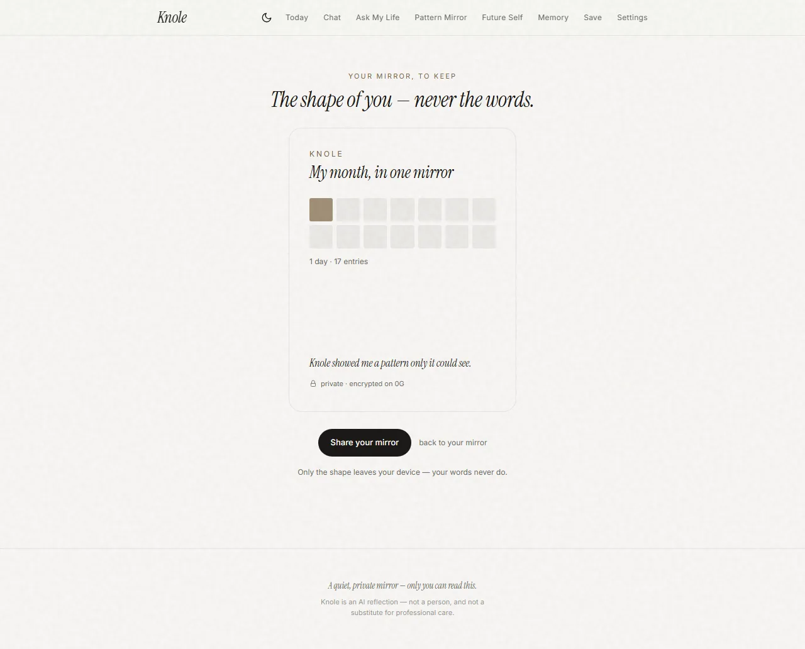

<div align="center">


<p><em>A mirror, not an assistant. You write; it reflects, remembers, and — only as much as you allow — reaches back.</em></p>

[](https://knole-app.vercel.app) [](https://youtu.be/W4ZamPWuO-Q) [](https://knole-app.vercel.app/proof-deck.html) [](https://comfortable-goal-205.notion.site/Knole-3869c0ce78768120b4bbce690981b6db)

<sub>explore the seeded demo · or sign in to start your own</sub>

 -2ea043?style=flat-square) -7c6f5b?style=flat-square)    

</div>

A private AI that **remembers your life**, helps you **see your own patterns**, and that **you own**: your entries live encrypted on [0G](https://0g.ai) under your key, the reflections that read them run in a **TEE so even we can't read them**, and your evolving memory mints as an **iNFT to your own wallet** — never for sale.

**See the whole product in two minutes** — [watch the demo](https://youtu.be/W4ZamPWuO-Q). Then don't take the claims on faith: the [**proof deck**](https://knole-app.vercel.app/proof-deck.html) walks the flow in screenshots and [`docs/PROOF.md`](docs/PROOF.md) backs every claim with the exact command, eval, spec, or recorded result — both state plainly what is pre-mainnet.

<div align="center">

|  |  |  |
| :---: | :---: | :---: |
| <br/><sub>**Today** — a reflection, from your own past</sub> | <br/><sub>**The Mirror** — a day-15 synthesis</sub> | <br/><sub>**Crisis-safe** — real help, not a chatbot</sub> |
| <br/><sub>**Own it** — minted to your wallet, not for sale</sub> | <br/><sub>**Private Wrapped** — the shape, never the words</sub> | <br/><sub>**Night** — a full dark theme</sub> |

</div>

## What it does

- **Today** — a daily journaling loop. Write an entry, get a real reflection that quietly weaves in something you said before — through one of four **lenses** (Gentle Mirror / Pattern Finder / Blunt Friend / Decision Coach) and an anti-sycophancy engine that won't just flatter you. A one-tap **check-in** keeps the streak on the days you can't write.
- **Chat** — think out loud; it holds the conversation and your history, and can turn a thread into a real entry.
- **Ask My Life** — ask a question about your own past; it answers grounded in your entries and quotes you back to yourself (RAG, with receipts).
- **The Mirror** _(the flagship)_ — a private letter from yourself. For your first two weeks it quietly builds — a streak and a countdown; then on **day 15 it reveals**: patterns that each quote a real entry by date, the contradiction you live in, the thing you keep avoiding. Pure synthesis of your own words — no advice, no judgement.
- **Future-Self** — a letter from the person your own entries are pointing toward, grounded in real commitments.
- **The Index** — every memory Knole holds, with its source quote and a `⬡ 0G` badge when it's anchored on-chain. Pin, edit, or forget any of it; every change is logged append-only. **Mint it as an iNFT** to your own wallet.
- **Remembered · On-This-Day** — Knole resurfaces an earlier entry "at the moment it matters," and you can answer your past self.
- **Wrapped · Year** — a shareable card of the _shape_ of your year (never the words), and the whole arc on one page.
- **Settings** — the consent contract: a downward-only proactivity dial, quiet hours, and Knole's voice. A live **"Your data on 0G"** panel that decrypts an entry straight from chain, and a **"seal to your wallet"** toggle for client-side encryption.
- **Safety** — an entry about self-harm pauses the reflection and surfaces real help (988 · 741741 · 911); every surface discloses Knole is an AI, not a person (SB243).

## Four privacy layers

Privacy and a memory that understands you are usually opposed — to remember you, a model has to read you. Knole splits the layers so no single one ever holds both your plaintext and your name.

| Layer | What lives here | Who can see it |
| --- | --- | --- |
| **Local** (never leaves the machine) | embeddings (`all-MiniLM-L6-v2`) + the name-scrub (`bert-base-NER`), via `@xenova/transformers` | only your machine |
| **Anonymised** (what the model sees) | your text with names replaced by stable tokens, through one gateway (`sealed.ts`) | the model — never your real names |
| **Sealed inference** (where it's read) | reflection runs inside a **0G TEE** (0G Private Computer, `glm-5.1`) | the enclave — not even the operator |
| **Encrypted** (what 0G holds) | AES-256-GCM ciphertext under an HKDF per-user key — or a **key only your wallet can derive** | only your key |

## You own it — on 0G

- **Storage** — each entry is AES-256-GCM encrypted and uploaded to **0G Storage** (Galileo testnet); the returned root hash is anchored on the entry row. The key is derived per-user — or, if you enable it, derived from a **wallet signature that never reaches the server**, so not even we can read that copy.
- **Restore-from-chain** — the Postgres copy is only a cache. `restoreEntryFromChain` rebuilds any entry's text purely from 0G; the Settings panel does this live so you can watch your data come back from chain.
- **Sealed Inference (on)** — user-facing generations route through `chatPrivate`, which calls **0G Private Compute (TEE)** on `glm-5.1`. A stalled enclave falls back to NVIDIA within 15s so the app never goes dark, and the name-scrub protects that fallback too. The on-Mirror attestation badge only shows when the inference genuinely ran in the enclave.
- **Memory iNFT** — mint your evolving identity snapshot as an **ERC-7857** token to your own wallet ([`contracts/KnoleMemory.sol`](contracts/KnoleMemory.sol), live on Galileo at `0xf45C33fa8005734E67F9E99De844D220A18D898E`). It's encrypted under your key on 0G; the token records only the root + a hash. Mint and self-custody need no oracle, and every transfer path reverts — **it can never be sold out from under you.**

## The memory engine

Every entry flows through one pipeline:

1. **Embed** locally with `all-MiniLM-L6-v2` (via `transformers.js`) — 384-dim, private, no API call.
2. **Extract** durable, long-term facts with an LLM (people, goals, patterns, commitments, values) from the anonymised copy only.
3. **Reconcile**: a content-hash `UPSERT` reinforces exact duplicates, then an LLM judge resolves each near-match three ways (mem0-style) — reinforce a reworded duplicate, supersede a contradiction (bi-temporal — kept with `invalid_at`, never deleted), or keep a genuinely independent fact.
4. **Retrieve** with **RRF hybrid** search — pgvector cosine fused with lexical full-text — and each surfaced memory earns importance by being recalled.

Reflections, chat, Ask My Life, the Mirror, Future-Self, and the proactive nudge all draw on this engine, with an overnight **Dreaming** worker consolidating it hierarchically. A `npm run evals` gate measures it across **21 suites** — retrieval, extraction coverage, dedup, groundedness (no invented facts), contradiction/supersede, pinned-survival, user-correction-wins, provenance, forgetting, confidence-calibration, privacy-leak (0 PII to the model), crypto, and first-aha (<90s), among others — scored into the `eval_runs` table. Every suite must be green for the gate to pass.

## Proven end to end

Don't trust the screenshots — re-run them. The privacy, ownership, and isolation claims are commands; the whole authenticated journey is a headless test.

| Claim | Check it |
| --- | --- |
| The memory works | `npm run evals` — 21 suites, all green |
| Your name never reaches the model | `npm run test:anon` |
| Ciphertext at rest on 0G | `npm run test:privacy` |
| Recoverable byte-identical from chain | `npm run test:restore` |
| Nobody else can read it | `npm run test:multiuser` |
| Leave with everything | `DB_HTTP=1 npm run test:export` |
| **Logged in, end to end, for real** | `npm run test:e2e` — [`wallet-connect.spec.ts`](e2e/wallet-connect.spec.ts): real inbox → Privy OTP → wallet-signed encryption → **on-chain iNFT mint**, headless |

## Stack

| Layer      | Choice                                                            |
| ---------- | ---------------------------------------------------------------- |
| Framework  | TanStack Start (Router + Query) · React 19 · Vite                |
| UI         | Tailwind CSS v4 · shadcn/ui (Radix) · Instrument Serif + Inter · a full Night theme |
| Server     | TanStack Start server functions                                  |
| Database   | Neon Postgres + `pgvector` (HNSW) via Drizzle ORM                |
| Embeddings | `@xenova/transformers` — all-MiniLM-L6-v2 (local)                |
| LLM        | **0G Sealed Inference** (`glm-5.1`, TEE) → NVIDIA NIM fallback   |
| Chain      | 0G Galileo testnet — Storage · Private Compute · ERC-7857 iNFT · `ethers` |
| Auth       | Privy (email-OTP · wallet · social → sealed session)             |

## Quickstart

```bash
npm install
cp .env.example .env          # fill in the values (see comments in the file)

npx drizzle-kit migrate       # apply migrations to your Neon database

# full-text indexes for RRF hybrid retrieval (run once):
#   CREATE INDEX IF NOT EXISTS memories_content_fts ON memories USING gin (to_tsvector('english', content));
#   CREATE INDEX IF NOT EXISTS entries_text_fts    ON entries  USING gin (to_tsvector('english', text));

npm run dev                   # http://localhost:3000
npm run evals                 # run the memory-engine eval gate
```

You'll need: a Neon Postgres URL (with the `vector` extension enabled via `CREATE EXTENSION IF NOT EXISTS vector;`), an NVIDIA NIM API key, and — for the on-chain features — a funded 0G Galileo testnet wallet. To enable the TEE, set `OG_SEALED_INFERENCE=on` with a [pc.0g.ai](https://pc.0g.ai) key (`ZG_SERVICE_URL`, `ZG_API_SECRET`, `ZG_MODEL=glm-5.1`) — no KYC, no funded ledger. To enable minting, deploy the iNFT (`node scripts/deploy-inft.mjs`) and set `KNOLE_NFT_ADDRESS`.

## Production

```bash
npm run build                 # → dist/ (client assets + dist/server/server.js SSR handler)
npm run preview               # serve the production build locally to verify
```

`npm run build` emits a static client bundle (`dist/client`) and an SSR handler (`dist/server/server.js`); deploy both behind a Node host (or your platform's adapter). The same server-side env vars are required at runtime (`DATABASE_URL`, `NVIDIA_API_KEY`, `EVM_PRIVATE_KEY`, `KNOLE_KDF_SECRET`, the `ZG_*` sealed-inference keys, `KNOLE_NFT_ADDRESS`, …). Set `VITE_SITE_URL` to your deployed origin so social-share tags resolve, and run the Dreaming worker (`npm run worker`) on a scheduler. Rotate every secret before any non-testnet use.

## Scripts

| Command          | Purpose                                                       |
| ---------------- | ------------------------------------------------------------- |
| `npm run dev`    | Dev server                                                    |
| `npm run build`  | Production build (client + SSR)                               |
| `npm run evals`  | Memory-engine release gate → `eval_runs`                      |
| `npm run test:e2e` | Playwright — the full-product sweep + real-wallet journey    |
| `npm run dream`  | Dreaming consolidation → `reflection_artifacts`               |
| `npm run worker` | Scheduler — runs Dreaming per user (`-- --once` for one tick) |

## Status

Phase 1 (testnet) — the full experience runs on the real engine and 0G: Privy auth with per-user encryption and multi-user isolation, streaming reflections, the memory engine, Ask My Life, the 14-Day Mirror, Future-Self, consent-respecting proactivity, the overnight Dreaming consolidation, refugee import, the Chrome extension, authenticated at-rest encryption, **sealed inference in the 0G TEE**, **client-side wallet encryption**, the **memory iNFT**, SB243 crisis-safety, and a 21-suite eval gate — with a headless real-wallet end-to-end test covering the whole authenticated path. What's left: subscription billing (Stripe + 0G Pay), a hosted cron for the worker, and the Phase-2 hardening pass — KDF secret → KMS/enclave, key rotation, and a security audit — before the 0G Aristotle mainnet flip.

---

_Private by design. Encrypted under your key, sealed to your wallet, read inside a TEE, minted to you. We can't read it, can't reset it, can't take it away._
</content>
