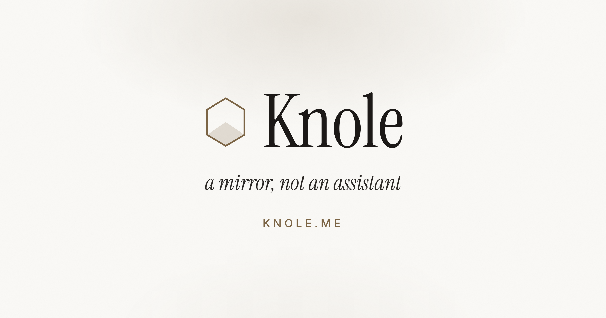
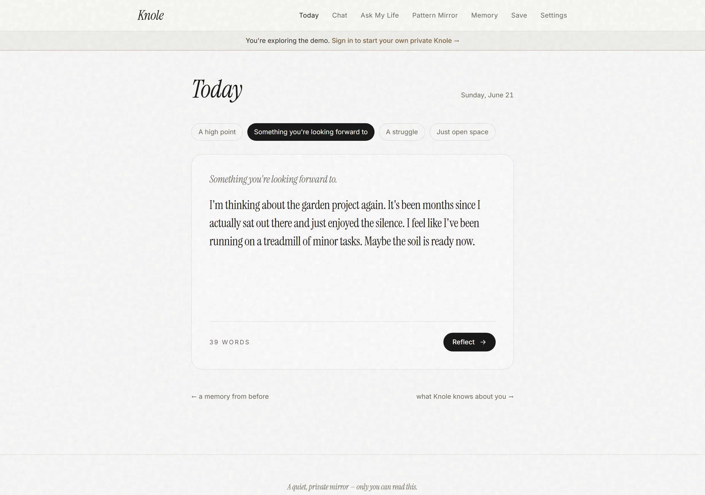
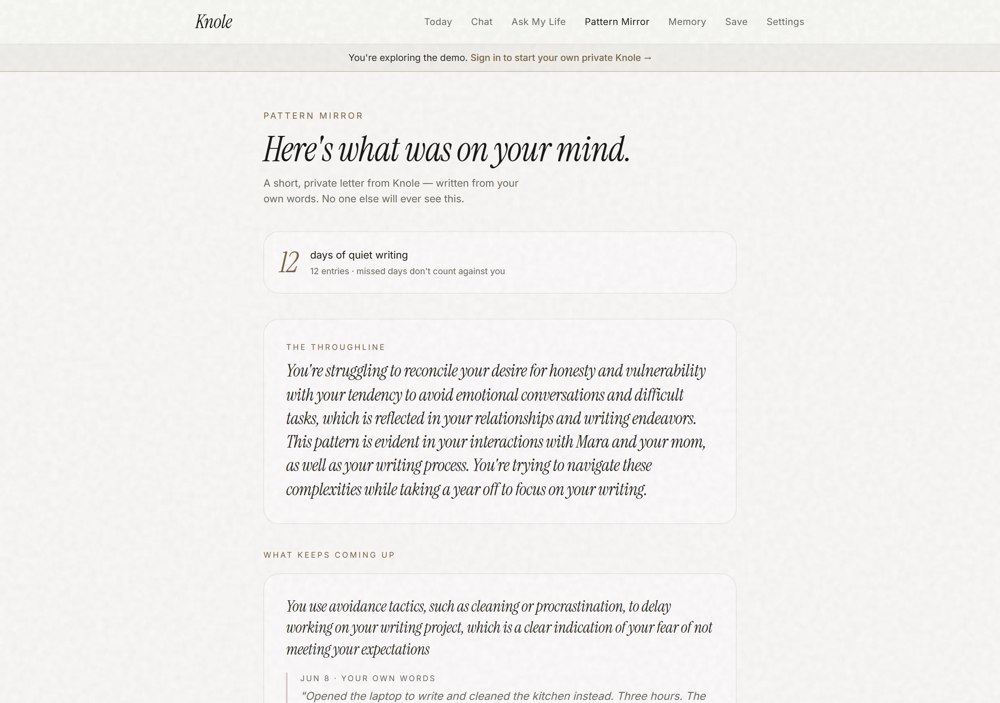
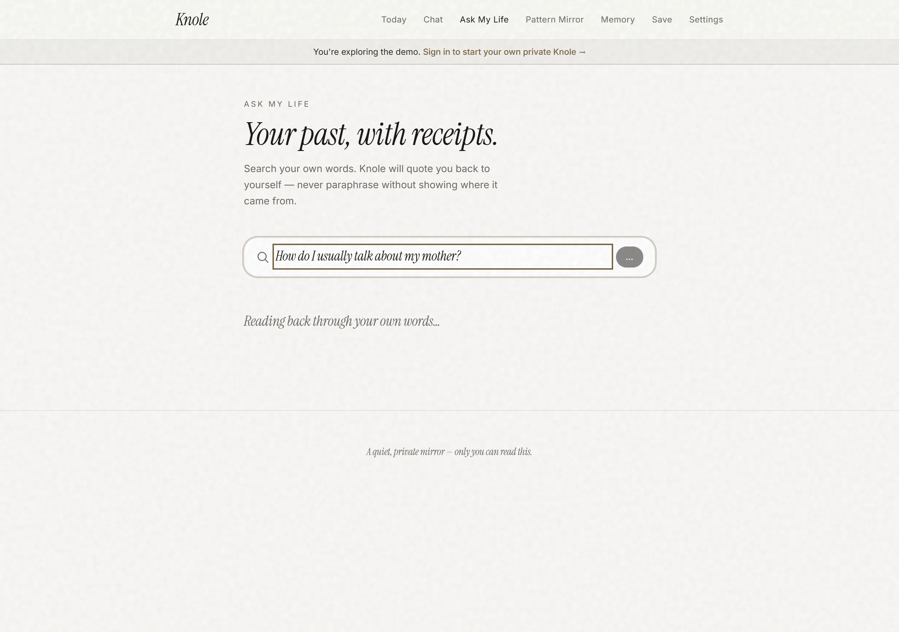
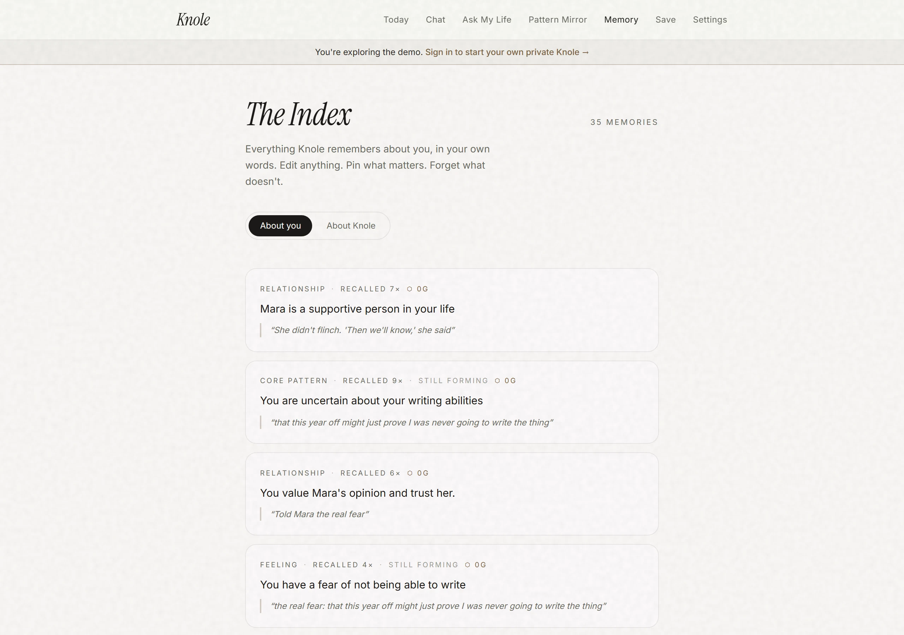
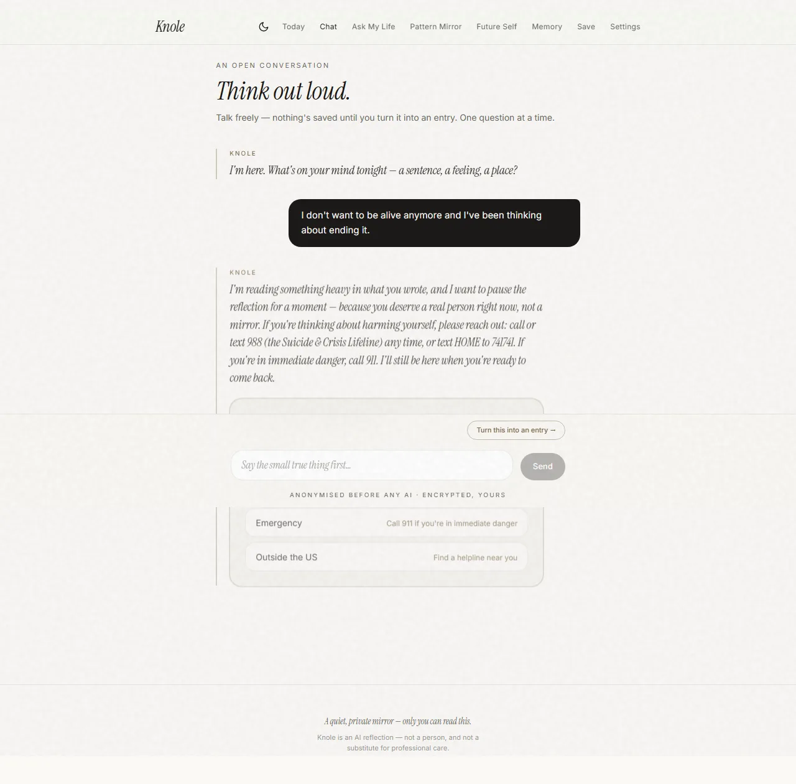
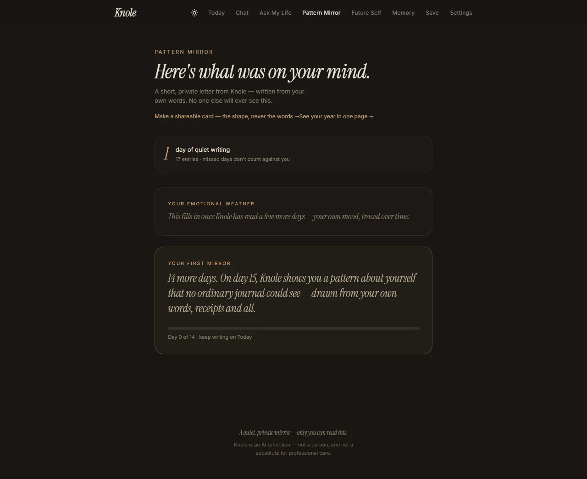
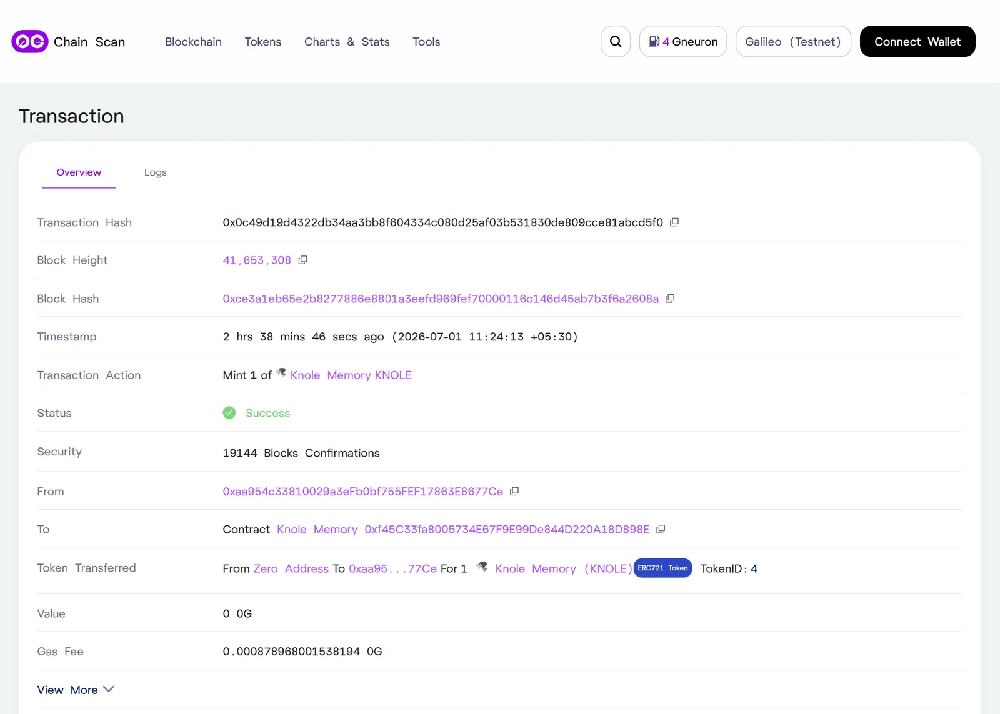

<div align="center">



<h3>A private AI journal that acts as a mirror, not an assistant</h3>

<p><em>Anonymized before inference · read inside a 0G TEE · encrypted under your key · recoverable from 0G · minted to your wallet</em></p>

[](https://knole.me) [](https://youtu.be/rqOQbSuONPg) [](https://knole.me/proof-deck.html) [](https://comfortable-goal-205.notion.site/Knole-3869c0ce78768120b4bbce690981b6db)

 -2ea043?style=flat-square)   [](https://github.com/Pratiikpy/Knole/actions/workflows/ci.yml) 

</div>

> **📖 Start here → [the full product overview on Notion](https://comfortable-goal-205.notion.site/Knole-3869c0ce78768120b4bbce690981b6db)** — the complete story: visuals, architecture, PMF research, the privacy model, and the build journey. **If you open one link, make it this one.** Everything below is a summary.

<div align="center">

| | | |
|:---:|:---:|:---:|
| <br/><sub>**Today** — a reflection from your past</sub> | <br/><sub>**The 14-Day Mirror** — patterns, dated</sub> | <br/><sub>**Ask My Life** — quoted with receipts</sub> |
| <br/><sub>**The Index** — editable, ⬡ 0G-stamped</sub> | <br/><sub>**Crisis-safe** — real help, not a bot</sub> | <br/><sub>**Night** — a full dark theme</sub> |

</div>

---

## The Problem

AI has quietly become where people process their decisions, relationships, and emotions. Yet every AI journal asks you to trust a company with your most private writing — and that trust is a **policy, not a mechanism.** A court recently forced OpenAI to produce 20M "deleted" ChatGPT logs.

The missing piece isn't demand. It's **privacy, trust, and true ownership.** That is Knole.

## Proven demand — not a bet

The behaviour Knole productises already exists at scale. This is a validated market, researched end to end — not a hope.

- **Therapy & companionship is the #1 generative-AI use case** — ~31% of all usage, up from 17% the year before (HBR, 2025); ~1 in 4 Americans would rather talk to an AI than a therapist. The center of consumer AI, not a wellness niche.
- **People already hand-build this.** *"I fed 14 years of journals into Claude — it found a 4-month burnout cycle I never noticed"* (2k+ upvotes) · *"AI sees the patterns I refuse to accept; it's not sugarcoating."* The demand is here; the private, owned version isn't.
- **The category is funded, so the bet is de-risked** — **Rosebud** $6M (Bessemer, Tim Ferriss) on ~10k payers · **Mindsera** 80k users · **PIN AI** $10M (a16z) on private, user-owned AI. Knole's edge is sharper differentiation and *real* privacy, not first-mover risk.
- **Retention is what the category lives or dies on** — AI apps retain **21% vs 30.7%** for non-AI (RevenueCat, 2026); Knole's 30-second daily check-in is the on-ramp built to beat that.

**Every single feature maps to a demand people already voice.** The [feature-by-feature demand table on Notion](https://comfortable-goal-205.notion.site/Knole-3869c0ce78768120b4bbce690981b6db) ties each one to real evidence — Rosebud · Stoic · Daylio · Day One · Reddit · a court record · a16z. Nothing here is speculative.

## What Knole Does

*One private memory engine behind ~30 features across 25 routes — the full product, not a demo.*

- **Daily Reflection** — reflects through four lenses (**Gentle Mirror · Pattern Finder · Blunt Friend · Decision Coach**), grounded in your own history and built to challenge, not flatter. Reflections **stream token-by-token**, and each one leaves a tamper-evident on-chain receipt.
- **The 14-Day Mirror** — every two weeks, a private letter from your past self: recurring patterns, contradictions, and avoided decisions, each tied to a dated entry.
- **Life Canvas** — your whole life on one private page: a **mood arc**, a **theme constellation**, your **cast of characters**, and the journey grid — every panel drawn from your own entries. The artifact only your own data can make (`/canvas`).
- **Ask My Life** · **Ask Knole** · **Private Research** — answers drawn from your journal (quoted back by date with receipts), a private general assistant, and private web research (Qwen-Max on 0G).
- **The Index** — every memory with source quotes, edit/forget controls, append-only history, and a `⬡ 0G` badge; plus **"what the model saw"** (the anonymized text) and **tamper-evident recall** (memory history anchored on-chain).
- **⭐ Auditable AI** — a small sensing model fine-tuned on 0G for the entry-reading job (memories, mood, topics, a crisis tripwire), its training data (public only) published on 0G Storage and its provenance anchored on-chain — the open, fully verifiable counterpart to the TEE-sealed model that reads your entries: auditable, not a black box (`/verify`).
- **Structure & momentum** — Guided **Programs** · evidence-quoted **Intentions** · **Therapy-prep** session briefs · **Correlations** and **Decision Replay** over your own words · **Themes** · in-the-moment **deepening**.
- **Voice · Image · Capture** — **voice journaling** (Whisper on 0G) · reflective **image generation** (Z-Image) · **Chrome capture** from anywhere · ChatGPT/journal **import**.
- **Ownership & money** — **Memory iNFT** (ERC-7857, un-sellable) · **client-side wallet encryption** · **portable memory identity** (revocable grants) · **proof-of-journaling** streaks on-chain · **pay-with-0G** credits · full **export** and **restore-from-chain**.
- **And more** — Future-Self · AI Wrapped · Year Review · On-This-Day · Mood Timeline · Omission Radar · retention loop (digest + push) · Night theme · Crisis Safety (SB243).

## Privacy by Architecture

Trust is minimized at every layer:

1. Local **MiniLM** embeddings — the vectors never leave the machine
2. Local **anonymization** before any prompt
3. Reflection inside a **0G TEE** (sealed inference)
4. **AES-256-GCM** encryption under user-controlled keys
5. Encrypted storage on **0G Storage**
6. Memory roots anchored on **0G Chain**
7. Deterministic **restore from 0G**
8. **ERC-7857 Memory iNFT** — owned by the user's wallet, un-sellable

> Even if the enclave were compromised, the model would still only ever see **anonymized text.**

## Why 0G

| Layer | How Knole uses it |
| --- | --- |
| **0G Compute** | Sealed AI inference inside a TEE |
| **0G Storage** | Encrypted journal entries |
| **0G Chain** | Integrity roots + memory ownership (iNFT) |

If the external model is ever unavailable, Knole **falls back to the 0G TEE** — an outage costs latency, never capability or privacy.

## Proof, Not Promises

Every major claim is verifiable — and here's the on-chain proof, live on the 0G explorer:

<div align="center">

<br/><sub><b>A real ERC-7857 mint on 0G mainnet</b> — <a href="https://chainscan.0g.ai/tx/0x870749f28bb13807867b354f0030d2910e778d6718fcec21bbca13d8489ee115">verify the transaction ↗</a> · <a href="https://chainscan.0g.ai/address/0xf5F6Ee304e8BfD94666a4AdeC171d116e55c267A">the contract ↗</a></sub>
</div>

- **21 automated evaluation suites** in CI — retrieval, groundedness, privacy-leak, crypto, isolation
- **Restore-from-chain** verification with real mainnet roots
- A **headless real-wallet end-to-end run** — inbox → Privy OTP → wallet-signed encryption → on-chain mint
- A public **[Proof Deck](https://knole.me/proof-deck.html)** documenting every feature with screenshots and commands

Built entirely by a **solo developer** — every commit public.

## Built With

TanStack Start · React 19 · Neon Postgres + pgvector · Drizzle · local `all-MiniLM` embeddings · `transformers.js` NER · **0G Sealed Inference (`glm-5.1`, TEE) → 0G fallback (fully on 0G, no external LLM)** · AES-256-GCM + wallet-derived keys · ERC-7857 iNFT · Privy · 0G Aristotle mainnet via `ethers`

---

<details>
<summary><b>Run it locally</b></summary>

```bash
npm install
cp .env.example .env          # fill in the values (comments in the file)
npx drizzle-kit migrate       # apply migrations to your Neon database
npm run dev                    # http://localhost:3000
npm run evals                  # the 21-suite memory gate
```

You'll need a Neon Postgres URL (with the `vector` extension), an LLM key, and — for the on-chain features — a funded 0G mainnet wallet. Enable the TEE with `OG_SEALED_INFERENCE=on` + a [pc.0g.ai](https://pc.0g.ai) key; enable minting by deploying the iNFT (`node scripts/deploy-inft.mjs`) and setting `KNOLE_NFT_ADDRESS_MAINNET`.

</details>

<details>
<summary><b>Scripts & structure</b></summary>

| Command | Purpose |
| --- | --- |
| `npm run dev` / `npm run build` | dev server / production build (client + SSR) |
| `npm run evals` | memory-engine release gate → `eval_runs` |
| `npm run test:e2e` | Playwright — full-product sweep + real-wallet journey |
| `npm run worker` | overnight Dreaming consolidation |

`src/routes` file-based routes · `src/components/knole` app shell · `src/server` the engine (embed · anonymise · sealed inference · 0G storage · restore · reflect · mirror · ask · iNFT) · `src/db` Drizzle schema + pgvector · `contracts/KnoleMemory.sol` the ERC-7857 iNFT.

</details>

## Current Status

**Live on 0G Aristotle mainnet** — [knole.me](https://knole.me): 0G TEE sealed inference · local anonymization · encrypted storage · restore from 0G · the memory engine · 14-Day Mirror · reflection lenses · Ask My Life · private web research · voice journaling · the Index · wallet encryption · Memory iNFT · reflection receipts · tamper-evident recall · proof-of-journaling · pay-with-0G · portable memory identity · retention loop · Crisis Safety (SB243) · **Auditable AI** (published training data + on-chain model provenance) — all served fully on 0G.

**Before high-volume production:** an external security audit and KMS-backed key custody are recommended (the signing-key seam and rotation runbook are in place — see `HUMAN.md`).

---

<div align="center">

**A journal should belong to the person who wrote it.**
**Knole makes that a technical guarantee, not a legal promise.**

</div>
